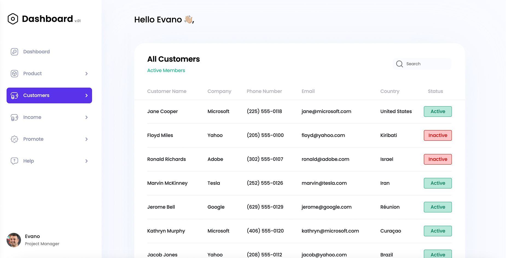

# <div align="center">Oksana Openko sexologist</div>



## Visit site

👉&nbsp;<a href="https://test-task-crm-dashboard-customers.vercel.app/" target="_blank">Click
here</a>

## Technologies used

- HTML
- CSS(SCSS)
- JavaScript
- React
- React Router DOM
- Normalize.css
- Vite

## Run it locally

clone the repository:

```
git clone https://github.com/tarik2454/test-task-CRM-Dashboard-Customers
```

set up dependencies:

```
npm install
```

run the application:

```
npm start
```

## My contacts

- **<a href="https://t.me/tarik_2454" target="_blank">Telegram</a>**
- **<a href="tarik2454@gmail.com" target="_blank">Email</a>**
